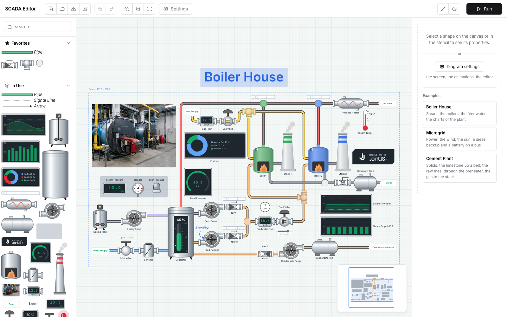
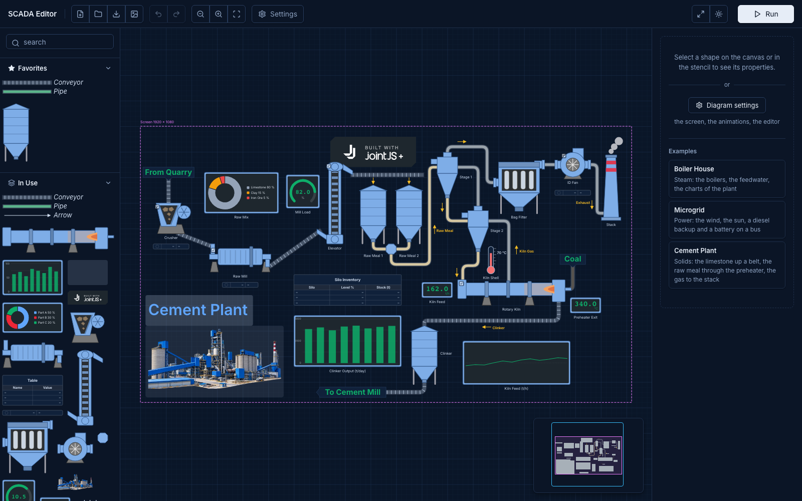

# JointJS+: SCADA Editor (TypeScript) <a href="https://www.jointjs.com/jointjs-plus"></a>

An editor of SCADA plant diagrams built with JointJS+, with a run mode where a simulated plant drives the diagram and the operator controls the equipment. A real plant connects through a tag / property / value interface. The shapes are based on the [SCADA demo](../../scada/).

 

- [User guide](docs/user-guide.md) - how to use it.
- [Feature list](docs/features.md) - what it does.
- [Developer notes](docs/dev-notes.md) - how it is built, how to connect a plant.

## Running the Demo

To run this application you need to have access to the JointJS+ package. You can get it by having a JointJS+ license or by starting a [free trial](https://www.jointjs.com/free-trial).

If you are a trial user, you received your access token during the trial sign-up process.
If you are a customer, log in to the customer portal at https://my.jointjs.com to obtain your access token.

This example uses the `.npmrc` file to set up access to the JointJS+ private npm registry. By default it reads the authentication token from the `JOINTJS_NPM_TOKEN` environment variable, which you can set in your terminal or CI environment:

**macOS / Linux**:
```sh
export JOINTJS_NPM_TOKEN="jjs-xxxxxxxx-xxxx-xxxx-xxxx-xxxxxxxxxxxx"
```

**Windows (PowerShell)**:
```sh
$env:JOINTJS_NPM_TOKEN="jjs-xxxxxxxx-xxxx-xxxx-xxxx-xxxxxxxxxxxx"
```

Learn more about our [private npm registry here.](https://docs.jointjs.com/learn/help-center/npm-registry)

After setting up access to the JointJS+ package, install the dependencies and start the dev server:

```bash
npm install
npm run dev
```
