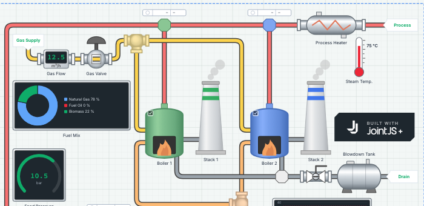
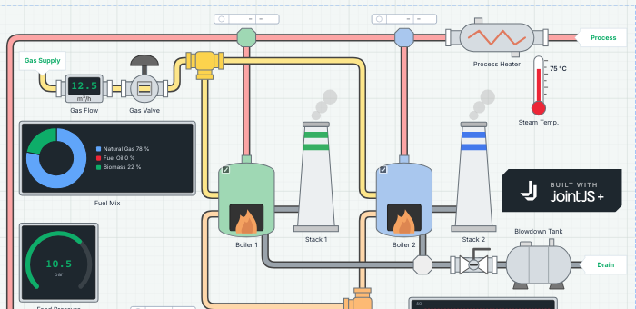
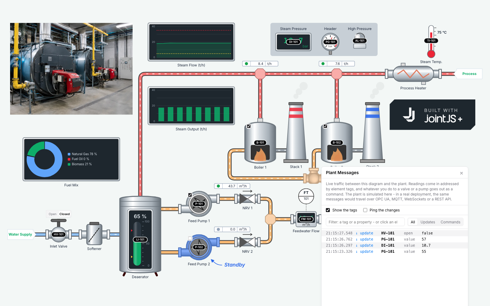

# SCADA Editor - Features

How to use them: [user guide](user-guide.md). How they are built: [developer notes](dev-notes.md).

The editor builds process diagrams (P&ID-style or high-performance HMI screens) and runs them: the diagram shows live plant data, the operator controls the equipment from it. In the demo the plant is simulated.

## Editing

- Drag and drop from a searchable palette, on a grid, with snaplines.
- Select by click, region, all, elements only, connections only, or same type.
- Move, resize, rotate; labels stay horizontal, on the side you choose.
- Copy, cut, paste, delete, undo, redo.
- Context menus on shapes and on the canvas.
- Every element gets an ID (`P-101`, `HV-101`) - the tag the plant uses.
- An inspector for one shape or several at once, with help on its fields.

## Shapes

88 shapes in 11 groups (the palette has the table twice: with and without a header):

| Group | Shapes |
|---|---|
| Piping | 10 - pipe, join, tee, cross, elbow, end cap, manifold, Y-strainer, orifice plate, zone |
| Rotating Equipment | 6 - pump, compressor, fan, blower, motor, turbine |
| Valves | 8 - control, hand, check, butterfly, ball, solenoid, relief, gate |
| Process | 10 - heat exchanger, filter, separator, boiler, reactor, distillation column, cyclone, air cooler, scrubber, bag filter |
| Storage | 9 - liquid, conical, mixing, spherical, horizontal and fuel tank, silo, hopper, water tower |
| Bulk Handling | 6 - conveyor, belt conveyor, bucket elevator, crusher, mill, rotary kiln |
| Structures | 2 - stack, cooling tower |
| Instruments | 10 - instrument bubble, pressure gauge, level panel, thermometer, flow meter, beacon, display, signal line, label, arrow |
| Electrical | 20 - diesel generator, wind turbine, solar array, power transformer, switchgear, motor control center, battery bank, generator, transformer, busbar, battery, breaker, disconnector, fuse, surge arrester, ground, lamp, heater, meter, wire |
| Charts | 6 - table (2 variants), line chart, bar chart, donut chart, gauge chart |
| Background | 2 - rectangle, ellipse |

Also: uploaded images (saved with the diagram), Favorites, and the shapes In Use.

## Connections

- Pipes connect to pipe stubs, wires to electrical terminals only, signal lines and arrows to shapes, conveyors to bulk equipment.
- Routing straight, orthogonal or curved; split a connection, insert a join into a pipe, disconnect a shape.
- A pipe takes the color of its medium.

## Layers and groups

- Five layers (background, pipes, equipment, instruments, foreground): pipes stay under the equipment, gauges over their tanks.
- Bring to front / send to back within a layer; move a covered shape into the layer above.
- Groups: nested, moved, copied, deleted and styled as a whole.

## Styling

- Finish: shaded metal, or flat (the ISA-101 high-performance HMI look) - per shape or for the diagram.

   

- Color, outline, accent - per shape or for the diagram; theme colors adapt to light and dark.
- Label size and color for the whole diagram (theme colors only).
- Canvas color - a light and a dark tone, flat or in a subtle gradient; the grid follows.
- Light and dark themes: the editor, the canvas and the shapes, switched in the toolbar (the system setting by default).

## Run mode

- Live data: gauges, levels, displays, charts and tables follow the plant; levels glide to new values.
- Animations: pumps spin, belts carry, flames burn, liquid flows, live circuits light up. "Alarms only" keeps the steady plant still (ISA-101); also used when the system asks for reduced motion.
- Operator controls: start / stop, open / close, a valve position slider. A control sends a command and shows it pending until the plant confirms the new state (request / confirm, as in real SCADA systems).
- A log of plant messages (time, tag, property, value): filter by text, direction or element; show tags on the diagram; ping elements as their messages arrive.

## Integration

- The plant sends tag, property, value (`FM-101 value 18.6`); the editor sends commands the same way. Nothing about the drawings is part of it.
- Any transport (WebSocket, MQTT, OPC UA, REST): replace the simulated plant with an adapter. Example in the [developer notes](dev-notes.md#connecting-a-plant).
- The UI theme of the editor's JointJS+ components is reusable in other apps.

## Files and examples

- New, open, save as JSON (with images, favorites, style); export a WebP image of the screen or the whole diagram.
- A screen (e.g. 1920 × 1080) marks what the operator sees; in run mode it fills the window.
- Three examples: a boiler house, a microgrid (wind, solar, diesel, battery on a 400 V bus), a cement plant.

## Not included

- A real plant connection - the adapter is yours to write.
- Users, authentication, permissions.
- A historian - no data beyond what the charts show during a run.
- An alarm system - no alarm list, acknowledgement or escalation.
- Server-side storage - files are opened from and saved to the user's computer.
