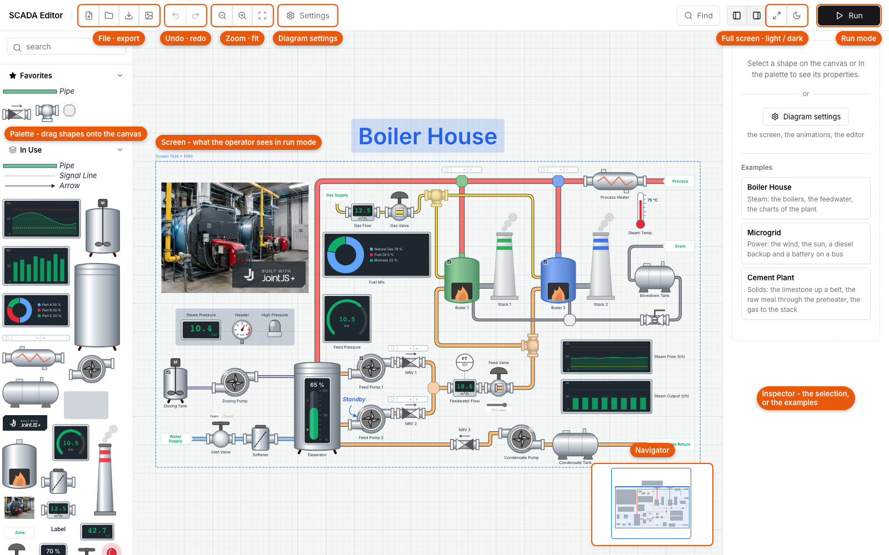
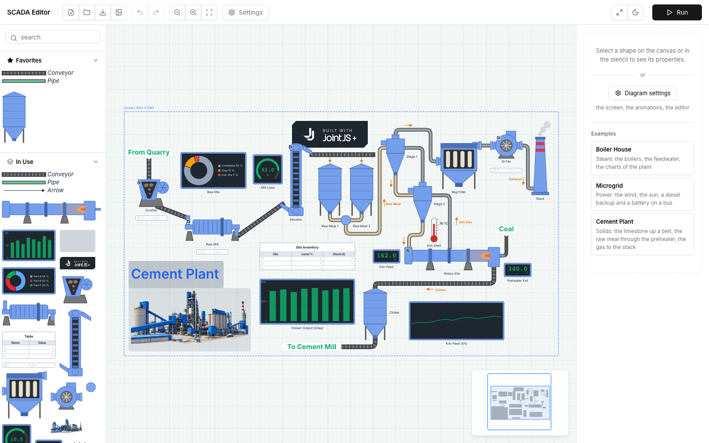
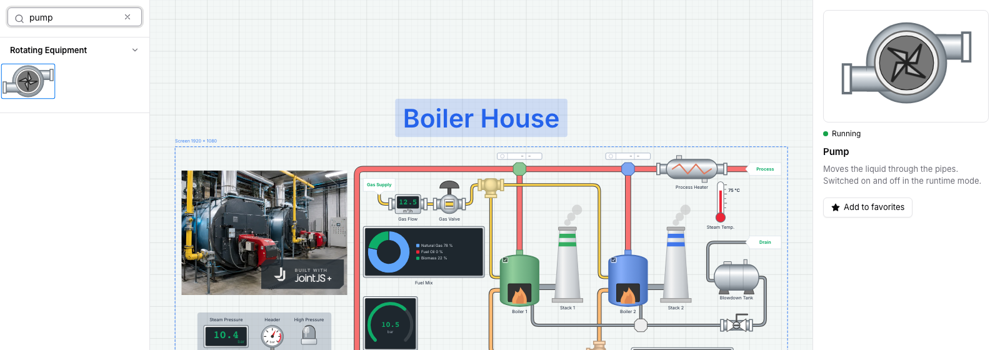
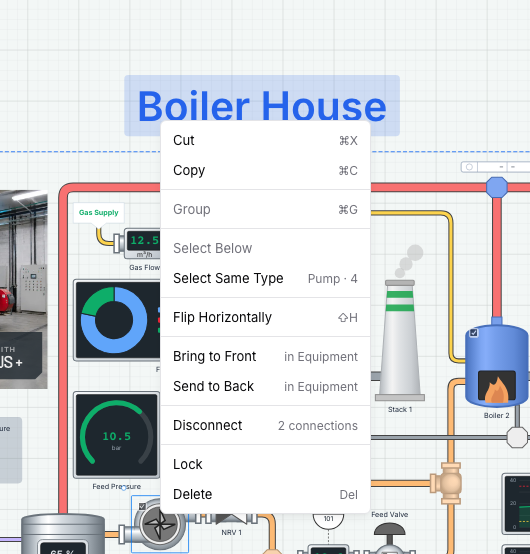
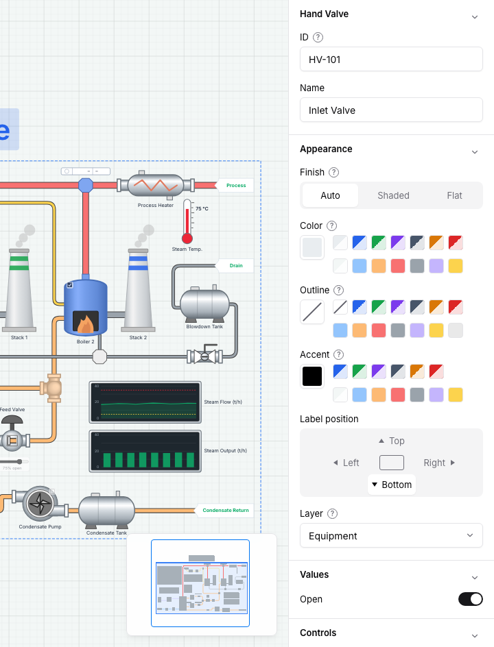
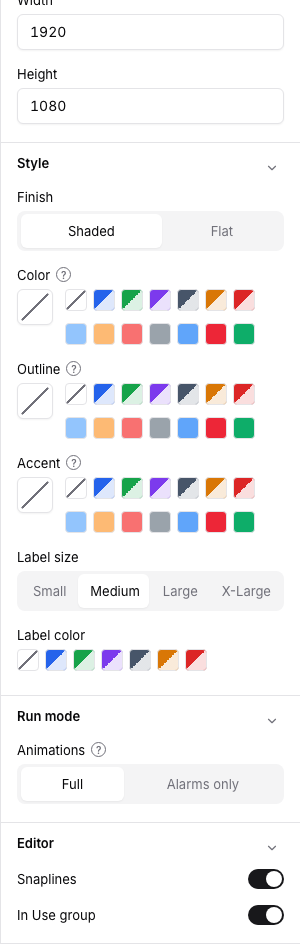
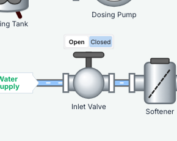

# SCADA Editor - User Guide

What it offers: [features](features.md). How it is built: [developer notes](dev-notes.md).

## Getting started

Palette on the left, canvas in the middle, inspector panel on the right. The toolbar: new, open, save, export image, undo / redo, zoom, Settings, full screen, light / dark, **Run**.

- **Examples** - with nothing selected, the inspector panel lists Boiler House, Microgrid and Cement Plant.
- **New diagram** - starts with a screen and opens the settings.
- **The screen** - the dashed frame (*Screen 1920 × 1080*) is what the operator sees in run mode.
- **Pan** by dragging the blank canvas, **zoom** with the toolbar or a pinch.

## The palette

- **Search** filters the shapes (*pump*, *valve*, *tank*).
- **Click** a shape to preview it: it runs, switching on and off. **Add to favorites** there.
- **Drag** a shape onto the canvas to add it.
- **Upload images** in the Custom group adds your own pictures; rename or delete one in its preview.
- **In Use** lists the shapes already in the diagram (can be turned off in Settings).

## Shapes

- **Select** - click; `Ctrl` / `Cmd` / `Shift` + click to add or remove; `Shift` + drag a region.
- **Select All / Elements / Connections** - right-click the blank canvas, or the [shortcuts](#keyboard-shortcuts).
- **Select Same Type** - right-click a shape: all shapes of the selected types (*Pump · 2*).
- **Select Below** - right-click where shapes overlap: the one underneath.
- **Move** by dragging; **resize** and **rotate** a single shape with its handles.
- **Label** - its text and *Label position* (top, left, right, bottom) in the inspector.
- **Control position** - the side of a valve's buttons or slider (Controls group).

## Connecting

- **Pipes** - drag one from Piping, then drag its ends onto the pipe stubs of the equipment.
- **Wires** - to the terminals of electrical shapes only.
- **Signal lines** and **arrows** - to a shape; an arrow can also point from a Label. Its ends and color are in the inspector.
- **Conveyors** - to the body of the equipment.
- **Routing** - Straight, Orthogonal or Curved in the inspector; drag the handles to move ends and bends.
- **Size** of a pipe (Small, Medium, Large), **Thickness** of a wire (Thin, Normal, Thick) - in the inspector.
- **Split Here** / **Insert Join** - right-click a connection / a pipe.
- **Disconnect** - right-click a shape: its connections stay, their ends freed where they were; the shape moves off them.

## The inspector

- **ID** - the tag the plant uses (*HV-101*), and the texts.
- **Appearance** - Finish (Auto, Shaded, Flat), Color, Outline, Outline width, Accent (the slashed swatch is Auto), Label position, Layer. *Outline width* shows while the shape is outlined: an outline color of its own, or flat.
- **Values**, **Thresholds**, **Slices**, **Columns** - the data of the shape.
- **Controls** - *Use controls* and *Control position*.

`?` explains a field. With several shapes selected, a field that differs shows *mixed*.

## Groups

- **Group** - select shapes, right-click, *Group*. A group has a dashed frame and an ID badge.
- Click a member to select the group, click again to select the member; `Escape` goes one level up.
- **Ungroup** from the context menu. The group's inspector lists its members and styles them together.

## Layers

Background, Pipes, Equipment, Instruments, Foreground - pipes under the equipment, instruments over it.

- **Bring to Front / Send to Back** - within the layer.
- **Move to …** - offered when a shape is covered by a higher layer (or covers a lower one).
- **Layer** in the inspector sets it directly.

## Settings

**Settings** in the toolbar.

**Screen**
- *Enabled* - shows or hides the screen frame. Without a screen, run mode and the exported image show the whole diagram.
- *Width*, *Height* - the screen size in pixels. While the settings are open, drag the screen by its edge or its name to move it.

**Style** - the defaults for every shape that has no style of its own (Auto in its inspector).
- *Finish* - Shaded (gradients) or Flat.
- *Color*, *Outline*, *Accent* - the body, edge and detail colors.
- *Outline width* - Thin, Normal or Thick: the outlines of outlined shapes and the borders of the pipes.
- *Label size* - Small to X-Large, for shape labels (not for the Label shape).
- *Label color* - the text color of those labels.
- *Canvas* - the background color (White / Black, Blue, Green, Violet, Gray as in ISA-101, Sand; each with a light and a dark tone); the grid follows.
- *Canvas gradient* - the canvas lighter at the top, darker at the bottom (the exported image too).

**Run mode**
- *Animations* - Full: everything animates (running equipment, flames, levels). Alarms only: only the levels and the alarms move.

**Editor**
- *Snaplines* - guide lines that align a moved or resized shape with the others.
- *In Use group* - shows or hides the In Use group in the palette.

## Run mode

**Run** starts the plant; **Edit** goes back (nothing of the run is kept). A screen fills the window; move the pointer to the top for the toolbar.

- **Controls** - a checkbox starts or stops a pump or a burner, *Open* / *Closed* switches a valve or a breaker, a slider sets a control valve. The request shows as **pending** until the plant confirms it (5 s at most).

  

- **Log** - the messages between the diagram and the plant: time, *update* or *command*, tag, property, value.
  - *Show the tags* - the IDs on the diagram.
  - *Ping the changes* - an element pings when its message arrives (blue update, amber command).
  - Filter by words, by All / Updates / Commands, or by clicking elements on the diagram.
  - Click a message to highlight its element (and mark its messages); click it again to clear.

## Files

- **Save** - downloads `scada-diagram.json` (with images, favorites, style).
- **Open** - loads a saved file.
- **Export image** - downloads `scada-diagram.webp`: the screen, or the whole diagram without one.

Replacing a diagram with changes (new, open, an example) asks first.

## Keyboard shortcuts

Edit mode, not while typing. `Cmd` on macOS, `Ctrl` elsewhere.

| Action | Shortcut |
|---|---|
| Undo / redo | `Cmd` + `Z` / `Cmd` + `Y` or `Cmd` + `Shift` + `Z` |
| Copy / cut / paste | `Cmd` + `C` / `X` / `V` |
| Select all | `Cmd` + `A` |
| Select elements only | `Cmd` + `Shift` + `A` |
| Group / ungroup | `Cmd` + `G` / `Cmd` + `Shift` + `G` |
| Duplicate (drag a copy) | `Cmd` or `Alt` + drag an element |
| Delete | `Delete`, `Backspace` |
| Close a menu, one group level up, clear the selection | `Escape` |
